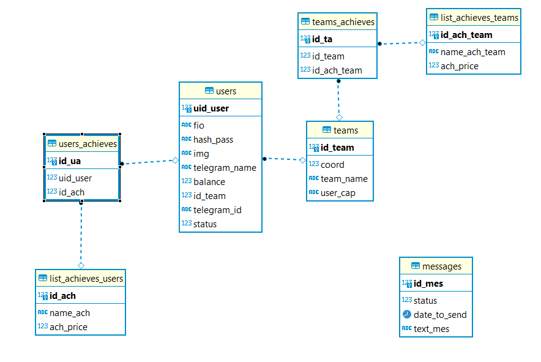

# Backend


1. Linux / Mac
```bash
foo@bar:~$ cd simple
foo@bar:~$ virtualenv env
foo@bar:~$ source env/bin/activate
```

1. Windows
```bash
foo@bar:~$ cd simple
foo@bar:~$ virtualenv env
foo@bar:~$ env/Scripts/activate.ps1
```

2. Установка зависимостей
```bash
foo@bar:~$ pip install requirements.txt
```

3. Подключение к базе данных

3.1 Нужно задать переменную окружения 

*Windows*
```bash
set DATABASE_URL=string
```

*Linux / Mac*
```bash
export DATABASE_URL=string
```
3.2 либо python-файл c названием config.py и переменной DATABASE URL

*Windows*

создать файл __config.py__

*Linux / Mac*
```bash
touch config.py
```

```python
DATABASE_URL = ''
```

4. Запуск
```bash
foo@bar:~$ python main.py
```

